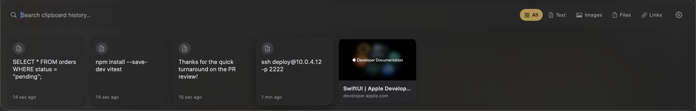
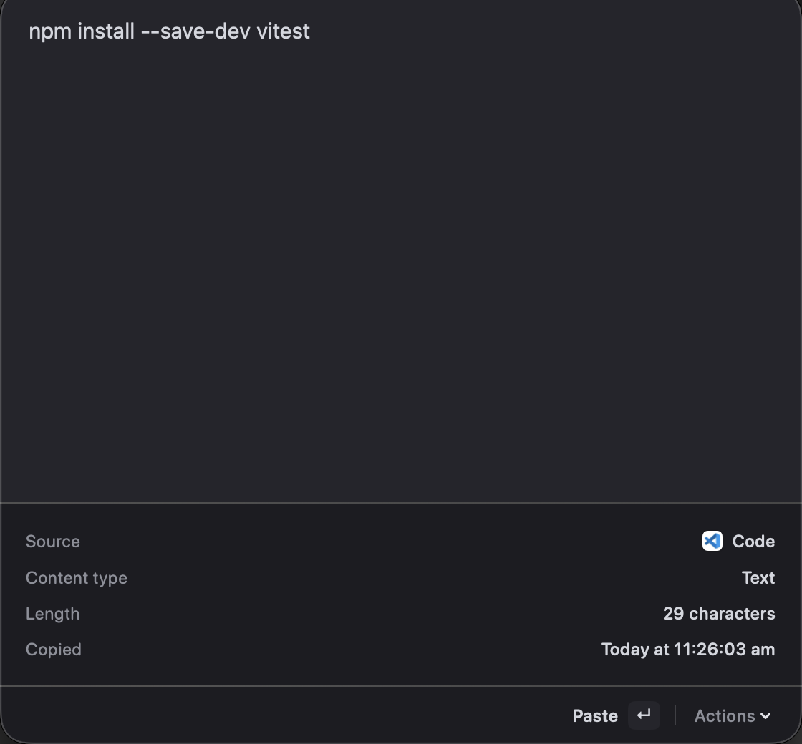
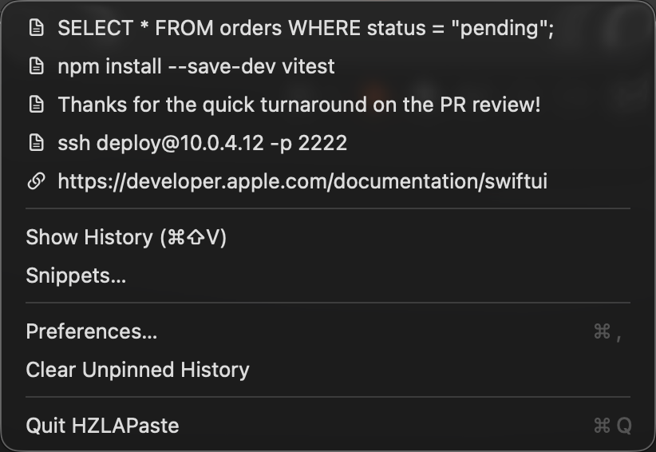
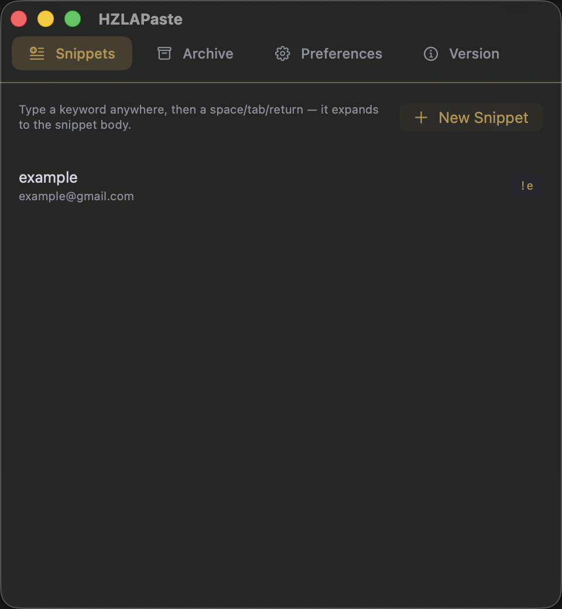
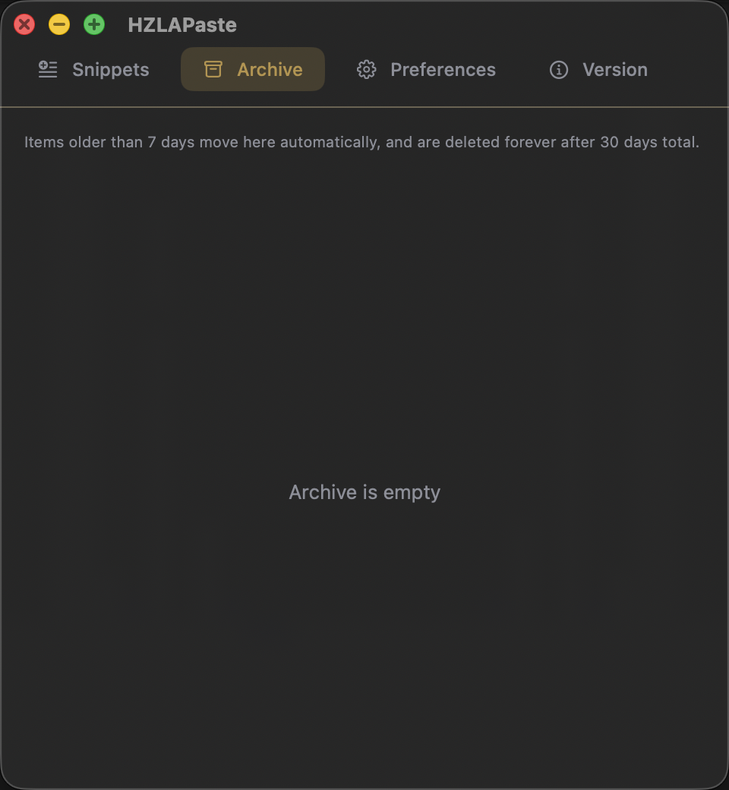
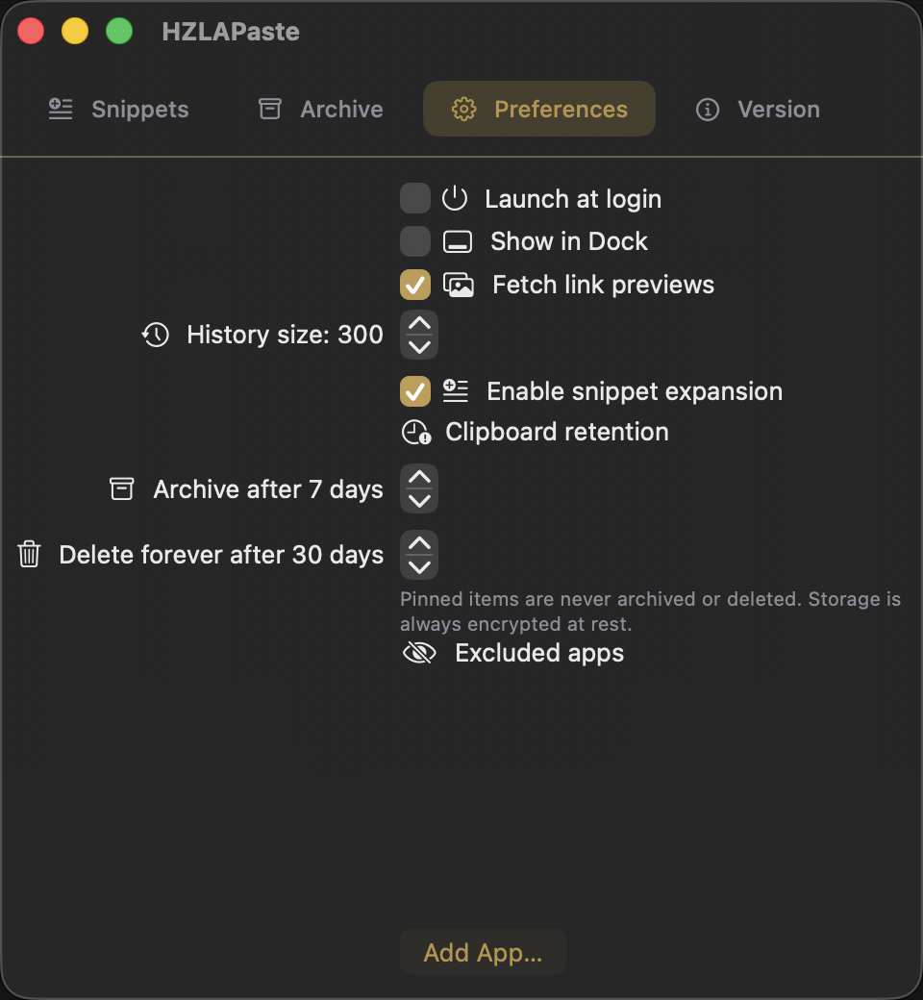

# HZLAPaste

A native macOS clipboard manager: a Raycast/Paste-style history bar, keyword
text expansion, link previews, and encrypted-at-rest storage — built with
Swift and SwiftUI.


## Features

### Clipboard history bar (⌘⇧V)
A floating, edge-to-edge glass bar docked above the Dock — press **⌘⇧V**
anywhere to bring it up, search or arrow through recent items, hit **Enter**
to paste into whatever app you were just in, **⌘Enter** to copy without
pasting, or **Esc** to dismiss.



- Captures **text, images (including animated GIFs), files, and links** copied anywhere.
- Copied links auto-fetch their page title and preview image.
- **Pin** items to keep them out of retention/archiving.
- Per-item **preview panel** with paste, copy, pin, and delete actions.
- Skips content from apps that mark it concealed/transient (e.g. password managers), and lets you manually exclude any app from being captured.



### Menu bar quick access
Lives in the menu bar (no Dock icon required) with pinned and recent items one
click away, plus shortcuts to Snippets, Preferences, and clearing history.



### Snippets (text expansion)
Define a keyword → body pair once, then type the keyword anywhere on the Mac
followed by a space/tab/return and it expands in place — the same trick as
Raycast or TextExpander, gated behind macOS Accessibility permission.



### Archive & retention
Unpinned items automatically move to an **Archive** tab after a configurable
number of days, then are permanently deleted after a second configurable
cutoff — copied content can be sensitive and shouldn't linger forever. Pinned
items are exempt. Anything archived can be restored or deleted early.



### Preferences
- Launch at login, show/hide the Dock icon
- History size limit
- Toggle link-preview fetching and snippet expansion
- Archive-after / delete-after retention windows
- Per-app exclusion list



### Encrypted at rest
Clipboard history and snippets are stored on disk encrypted with AES-GCM; the
key lives in the macOS Keychain, never embedded in the app or written next to
the data.

## Requirements

- macOS 14 (Sonoma) or later
- Xcode Command Line Tools (for building from source): `xcode-select --install`

## Installation

### Option A — DMG (easiest)
1. [Download HZLAPaste.dmg](https://github.com/hilyas6/HZLAPASTE/releases/latest/download/HZLAPaste.dmg) and double-click it to mount.
2. Drag **HZLAPaste** into **Applications**.
3. Launch it from Applications (first launch: right-click → Open, since it's locally signed rather than notarized by Apple).

### Option B — Build from source
```bash
git clone https://github.com/hilyas6/HZLAPASTE.git
cd HZLAPASTE
./build.sh
```
This builds a release binary with Swift Package Manager and packages it as
`HZLAPaste.app` in the project root. Open it with `open HZLAPaste.app`, or
drag it to `/Applications`.

To rebuild the `.dmg` installer instead:
```bash
./make-dmg.sh
```

### Permissions
On first use of a feature, macOS will prompt for:
- **Accessibility** — required for auto-paste (simulating ⌘V into the app you were using) and for snippet expansion. Grant it in **System Settings → Privacy & Security → Accessibility**.

Nothing else is needed — clipboard monitoring itself uses no private APIs and needs no permission.

## Releases

Every version is published on the [Releases page](https://github.com/hilyas6/HZLAPASTE/releases), each with a signed `HZLAPaste.dmg` attached. The DMG link above always points at the latest one.

## Usage

| Action | Shortcut |
|---|---|
| Open history bar | **⌘⇧V** |
| Paste selected item | **Enter** / click |
| Copy without pasting | **⌘Enter** / ⌘-click |
| Preview selected item | Space |
| Dismiss bar | **Esc** |
| Open Preferences | **⌘,** (from the bar or menu bar) |

## Adding screenshots

Capture these from a running instance of the app and save them under
`docs/screenshots/` with the exact filenames below — the README already links
to them, so no further edits are needed once they exist:

| Filename | What to capture |
|---|---|
| `menubar.png` | The menu bar icon |
| `menubar-dropdown.png` | The status item menu open, showing recent/pinned items |
| `history-bar.png` | The ⌘⇧V clipboard bar with a few items in it |
| `preview-panel.png` | The preview panel open on a selected item |
| `snippets.png` | The Snippets tab with at least one snippet defined |
| `archive.png` | The Archive tab |
| `preferences.png` | The Preferences tab |

Use **⇧⌘4** (drag to select an area) or **⇧⌘5** (screen recording toolbar, has
a window-capture mode) to take each one.

## License

MIT — see [LICENSE](LICENSE).
